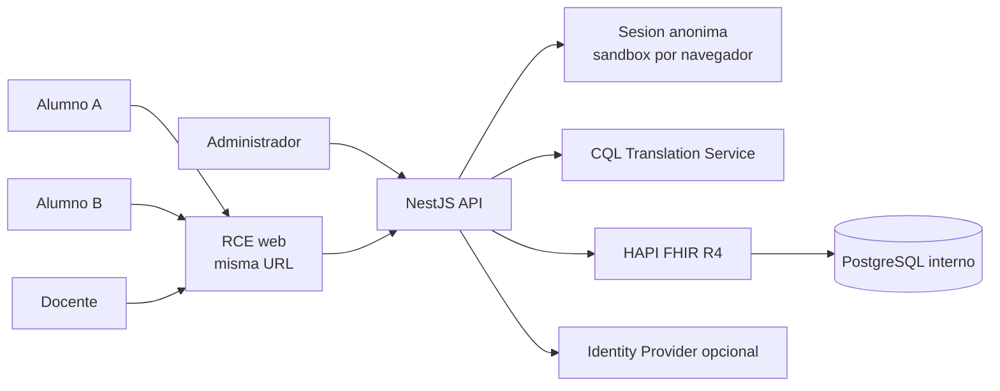
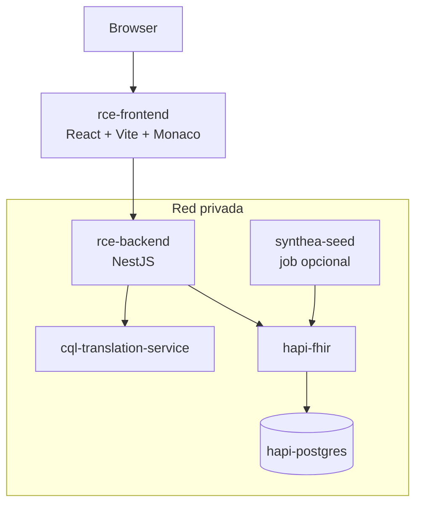
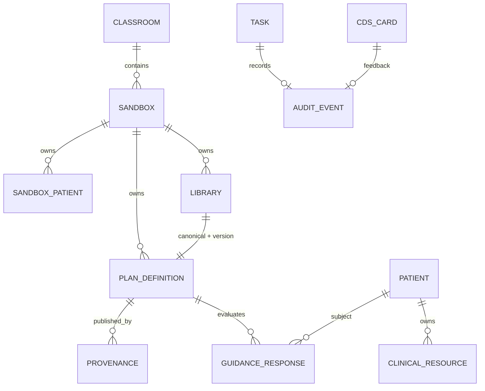
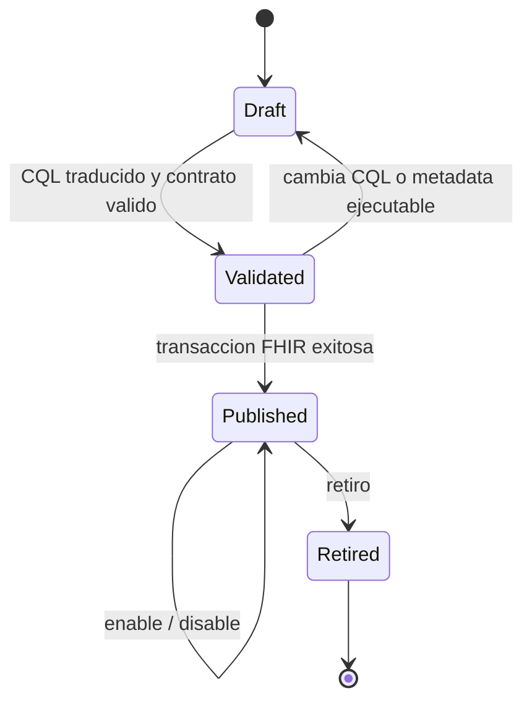
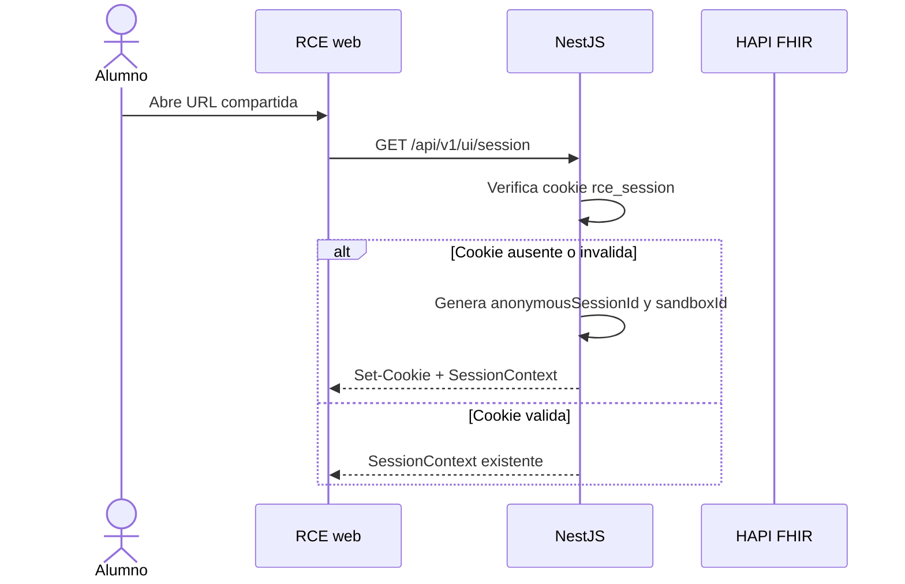
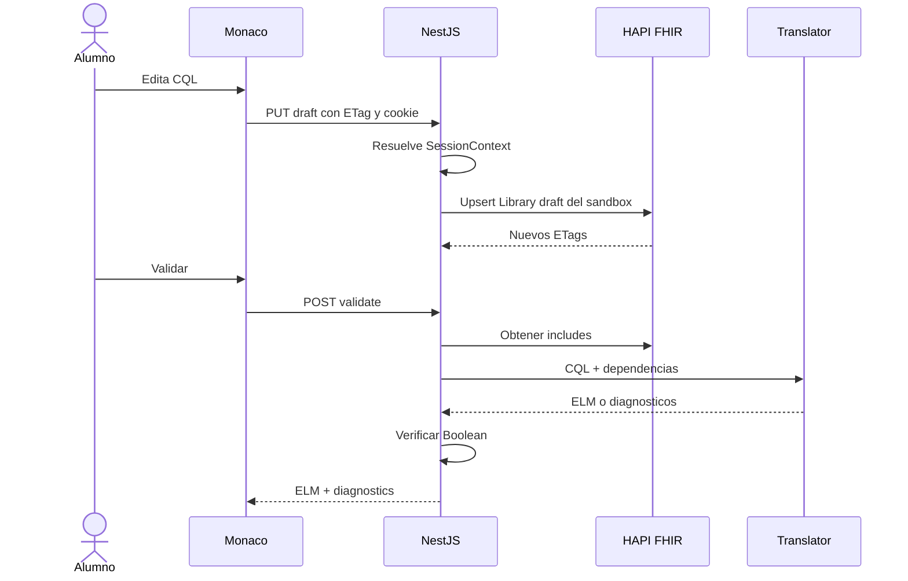
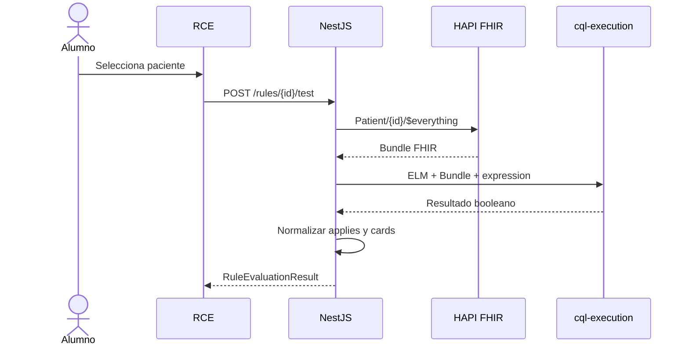
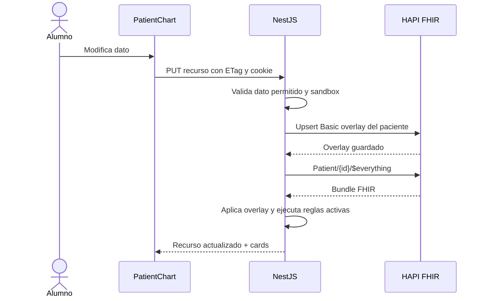

# Software Design Description (SDD)

## RCE educativo con CQL, HAPI FHIR y CDS Hooks

| Campo                  | Valor                       |
| ---------------------- | --------------------------- |
| Tipo de documento      | Software Design Description |
| Estado                 | En desarrollo               |
| Version                | 0.5.0                       |
| Fecha                  | 2026-07-26                  |
| Referencia estructural | IEEE 1016-2009              |
| Backend                | NestJS + TypeScript         |
| Interoperabilidad      | FHIR R4, CQL/ELM, CDS Hooks |

## 1. Proposito del SDD

Este documento describe como se construira el sistema definido en [REQUIREMENTS.md](./REQUIREMENTS.md). Registra decisiones de diseno, vistas arquitectonicas, elementos, interfaces, relaciones, comportamiento dinamico y justificaciones relevantes para implementadores y revisores.

La organizacion por stakeholders, concerns y vistas esta guiada por IEEE 1016-2009. IEEE 1016-2009 se encuentra en estado inactivo-reservado; se utiliza como referencia estructural y no como declaracion formal de conformidad.

Las unidades de implementacion derivadas del diseno se encuentran en [TASKS.md](./TASKS.md).

## 2. Alcance del diseno

El SDD cubre:

- SPA educativa con Monaco Editor.
- Backend NestJS como monolito modular.
- Integracion HTTP con CQL Translation Service.
- Persistencia FHIR R4 en HAPI y ejecucion CQL educativa en Nest.
- Empaquetado de CQL/ELM como artefactos FHIR.
- Pruebas de reglas contra pacientes sinteticos.
- API CDS Hooks y generacion de cards.
- Modo aula anonimo con sandbox por navegador.
- Escrituras clinicas confirmadas, auditoria y operacion local.

No disena internamente HAPI, PostgreSQL, Monaco, el traductor CQL ni el CQL Engine.

## 3. Referencias de entrada

- Requisitos funcionales `REQ-F-*`.
- Requisitos de interfaces `REQ-I-*`.
- Requisitos de datos `REQ-D-*`.
- Requisitos no funcionales `REQ-NF-*`.
- Criterios de aceptacion `AC-*`.
- FHIR R4 como modelo de intercambio y persistencia logica.
- CQL/ELM como representacion de conocimiento clinico.
- CDS Hooks como contrato de soporte a decisiones.

## 4. Stakeholders y preocupaciones

| Stakeholder   | Concerns cubiertos por el diseno                                                 |
| ------------- | -------------------------------------------------------------------------------- |
| Alumno        | Editor integrado, errores comprensibles, pruebas reproducibles y cards visibles. |
| Docente       | Versionado, publicacion, activacion, escenarios y control de acciones.           |
| Desarrollador | Limites modulares, contratos, tipos, pruebas y reemplazo de dependencias.        |
| Administrador | Configuracion, health checks, logs, seguridad y despliegue.                      |
| Evaluador     | Trazabilidad entre requisitos, diseno, tareas y pruebas.                         |

## 5. Viewpoints y vistas

| Viewpoint      | Pregunta que responde                                 | Secciones |
| -------------- | ----------------------------------------------------- | --------- |
| Contexto       | Quienes usan el sistema y con que sistemas se integra | 7         |
| Contenedores   | Que procesos se despliegan y como se comunican        | 8 y 15    |
| Descomposicion | Como se divide frontend y backend                     | 9         |
| Interfaces     | Que contratos se exponen o consumen                   | 10        |
| Informacion    | Como se representan reglas, versiones y pacientes     | 11        |
| Dinamica       | Como se validan, publican y ejecutan reglas           | 12        |
| Seguridad      | Como se protegen datos y operaciones                  | 13        |
| Operacion      | Como se observa y mantiene el sistema                 | 14 a 17   |

## 6. Drivers y decisiones

### 6.1 Drivers principales

| Driver                                           | Requisitos                                              |
| ------------------------------------------------ | ------------------------------------------------------- |
| Editor CQL dentro del RCE                        | REQ-F-002, REQ-NF-018                                   |
| No construir parser ni engine                    | CON-004, CON-005                                        |
| HAPI como repositorio y ejecutor                 | CON-002, REQ-F-020, REQ-D-*                             |
| Versionado inmutable                             | REQ-F-012 a REQ-F-016                                   |
| Respuesta inmediata a cambios                    | REQ-F-030, REQ-F-031                                    |
| Integracion CDS estandar                         | REQ-F-032 a REQ-F-042                                   |
| Una URL para clase con aislamiento por navegador | REQ-F-051 a REQ-F-055, REQ-D-010, REQ-D-011, REQ-NF-027 |
| Prototipo pequeno y mantenible                   | REQ-NF-022, REQ-NF-024                                  |

### 6.2 Registro de decisiones

| ID      | Decision                                           | Razon                                                                                                                      | Consecuencia                                                                                                                |
| ------- | -------------------------------------------------- | -------------------------------------------------------------------------------------------------------------------------- | --------------------------------------------------------------------------------------------------------------------------- |
| ADR-001 | NestJS modular para el backend                     | El trabajo principal es orquestacion HTTP y TypeScript reduce friccion con el frontend.                                    | El CQL Engine no se embebe en Nest.                                                                                         |
| ADR-002 | Monolito modular                                   | El alcance no justifica microservicios propios adicionales.                                                                | Los limites internos deben respetarse mediante providers exportados.                                                        |
| ADR-003 | HAPI como repositorio logico unico                 | Evita duplicar pacientes y artefactos en otra base de datos.                                                               | Nest nunca consulta las tablas PostgreSQL de HAPI.                                                                          |
| ADR-004 | Traductor CQL externo                              | Reutiliza tooling mantenido por CQFramework.                                                                               | Validar requiere disponibilidad de otro contenedor.                                                                         |
| ADR-005 | Ejecucion ELM en Nest con engine existente         | `cql-execution` + `cql-exec-fhir` permite evaluar CQL real contra bundles FHIR sin crear un parser propio.                 | HAPI almacena datos y artefactos; Nest ejecuta la evaluacion educativa inicial.                                             |
| ADR-006 | Library FHIR por regla/version                     | Es la representacion FHIR adecuada para guardar CQL y ELM versionados en HAPI.                                             | PlanDefinition queda como evolucion posterior; el MVP evalua desde Nest.                                                    |
| ADR-007 | CDS Hooks en NestJS                                | Desacopla la API publica de capacidades opcionales de HAPI.                                                                | Nest mapea resultados booleanos CQL a cards educativas.                                                                     |
| ADR-008 | Evento interno para cambios genericos              | No existe un hook estandar para cualquier actualizacion FHIR.                                                              | `ClinicalDataChanged` no se publica como CDS Hook.                                                                          |
| ADR-009 | Confirmacion de sugerencias                        | CQL debe recomendar, no escribir silenciosamente.                                                                          | Frontend y backend implementan un flujo de aceptacion.                                                                      |
| ADR-010 | Sin base de datos propia en MVP                    | Reduce operacion y mantiene informacion funcional en FHIR.                                                                 | Idempotencia y auditoria se representan con recursos FHIR.                                                                  |
| ADR-011 | Un Compose principal en la raiz                    | Un solo comando debe conectar API, HAPI, traductor y PostgreSQL sin duplicar configuraciones del spike.                    | Los servicios propios se construyen desde el workspace y los motores externos usan imagenes fijadas.                        |
| ADR-012 | Fundacion paralela al spike M0                     | La ausencia local de Docker no impide implementar y probar configuracion, puertos y contratos no clinicos de Nest.         | M0 sigue bloqueando WBS 3-6 y ninguna prueba simulada cierra compatibilidad clinica.                                        |
| ADR-013 | HAPI local por perfil y HAPI institucional por URL | Desarrollo necesita datos sinteticos aislados, mientras el despliegue debe reutilizar el servidor institucional existente. | `local-hapi` nunca se habilita en el servidor y Nest mantiene el mismo `FhirGatewayPort` en ambos modos.                    |
| ADR-014 | Synthea versionado como job local reproducible     | Aporta historias FHIR R4 realistas sin usar datos identificables ni crear un generador clinico propio.                     | La demografia base es estadounidense; los casos pedagogicos exactos siguen requiriendo fixtures controlados.                |
| ADR-015 | Frontend Vite integrado por API Nest               | Permite desplegar una sola URL educativa sin exponer HAPI ni el traductor al navegador.                                    | `apps/web` consume `/api/v1/ui/*`; pacientes, reglas, overlays y actividad viven en HAPI mediante NestJS.                   |
| ADR-016 | Modo aula anonimo con sandbox por navegador        | El docente debe poder compartir una sola URL sin crear cuentas, pero 10 alumnos no pueden pisarse reglas ni pacientes.     | Nest emite una cookie firmada, resuelve `SessionContext` por solicitud y filtra/etiqueta todo dato mutable por `sandboxId`. |
| ADR-017 | Cache corto para listado de pacientes base         | Evita llamadas N+1 a `Patient/$everything` y reduce 503 en HAPI local durante clases.                                      | El listado usa TTL breve e indices de Condition/Encounter; la ficha y la evaluacion CQL siguen leyendo datos vigentes.      |

## 7. Vista de contexto



Reglas de contexto:

- El navegador solo conoce la URL de NestJS.
- Nest conoce las URLs de HAPI y del traductor por configuracion.
- PostgreSQL es privado y pertenece a HAPI.
- Un HAPI externo puede reemplazar los contenedores locales sin cambiar la API del RCE.
- En modo aula anonimo, todos comparten la misma URL y Nest separa el trabajo mediante `sandboxId`.

## 8. Vista de contenedores



| Contenedor                | Responsabilidad                                 | Persistencia propia                |
| ------------------------- | ----------------------------------------------- | ---------------------------------- |
| `rce-frontend`            | Interaccion educativa                           | No                                 |
| `rce-backend`             | Casos de uso y contratos                        | No en MVP                          |
| `cql-translation-service` | CQL a ELM                                       | No                                 |
| `hapi-fhir`               | API FHIR R4 y repositorio de recursos           | Mediante PostgreSQL                |
| `hapi-postgres`           | Persistencia interna HAPI                       | Volumen Docker                     |
| `synthea-seed`            | Generacion y carga inicial de FHIR R4 sintetico | No; termina despues de cargar HAPI |

Implementacion local actual:

- `api` se construye desde `apps/api/Dockerfile`; es codigo mantenido en este repositorio.
- `hapi` usa `hapiproject/hapi:v8.10.0-3` como repositorio FHIR local.
- `cql-translator` usa `cqframework/cql-translation-service:v2.9.0` y solo traduce CQL a ELM.
- `postgres` es almacenamiento privado de HAPI; Nest no accede a sus tablas.
- `synthea-seed` usa Synthea 4.0.0 con checksum, semillas y fecha de referencia fijas; solo existe bajo el perfil `seed-data`.
- `compose.yaml` en la raiz conecta los servicios permanentes y el job opcional sobre la red privada `rce-cql`.

## 9. Vista de descomposicion

### 9.1 Frontend

La implementacion de referencia sera React con Vite, TypeScript y Monaco Editor.
La especificacion visual, arquitectura de componentes y prompt de prototipado se
mantienen en [frontend/README.md](./frontend/README.md).

Rutas:

| Ruta              | Vista                                 |
| ----------------- | ------------------------------------- |
| `/patients`       | Busqueda de pacientes sinteticos.     |
| `/patients/:id`   | Ficha clinica y cards activas.        |
| `/rules`          | Catalogo de reglas y versiones.       |
| `/rules/new`      | Nuevo borrador.                       |
| `/rules/:id`      | Editor, metadata, diagnosticos y ELM. |
| `/rules/:id/test` | Prueba contra paciente.               |

Componentes principales:

- `RuleEditor`: Monaco y estado local del CQL no guardado.
- `RuleMetadataForm`: configuracion no expresada dentro de CQL.
- `DiagnosticsPanel`: lista diagnosticos y navega a su ubicacion.
- `ElmViewer`: modelo Monaco JSON en modo solo lectura.
- `PatientChart`: ficha y formularios clinicos autorizados.
- `RuleTestPanel`: seleccion de paciente y resultado.
- `CdsCardList`: cards, detalles y confirmacion de sugerencias.

Monaco no parseara CQL. Los errores de `/validate` se convertiran a model markers. El MVP puede registrar resaltado lexico y snippets; CQL Language Server queda como extension para completion, hover y diagnosticos interactivos avanzados.

### 9.2 Capas del backend

```text
Controller -> Application Use Case -> Domain/Port -> Adapter
```

- `api`: controllers, DTOs, guards y serializacion.
- `application`: comandos, consultas y orquestadores.
- `domain`: reglas de negocio y tipos sin dependencias de Nest.
- `infrastructure`: HTTP, FHIR, configuracion, logs y health.

Un modulo no importara archivos internos de otro modulo. La comunicacion se realizara mediante providers exportados o eventos de aplicacion tipados.

### 9.3 ClassroomSessionModule y AuthModule opcional

`ClassroomSessionModule` es el camino por defecto para clases sin login:

- Lee la cookie `rce_session`.
- Si no existe o no es valida, crea `anonymousSessionId`, `classroomId`,
  `sandboxId`, `role`, `issuedAt` y `expiresAt`.
- Firma la cookie con `ANONYMOUS_SESSION_SECRET`.
- Expone `SessionContext` para controllers, casos de uso, logs y adapters.
- Permite reiniciar solo el sandbox del navegador actual.
- No crea cuentas visibles, formularios de login ni perfiles de usuario.
- La implementacion inicial es stateless: no requiere una base propia ni crea un
  marcador de sesion en HAPI para abrir la UI. HAPI recibe el `sandboxId` solo en
  recursos mutables como Library privada, overlay de paciente, actividad CDS,
  Provenance o Task.

`AuthModule` queda como capa opcional para despliegues institucionales:

- Autentica JWT cuando `AUTH_ENABLED=true`.
- Resuelve roles `student` y `teacher`.
- Expone guards declarativos para operaciones compartidas.
- Puede coexistir con `ClassroomSessionModule`: el JWT identifica al actor y el
  sandbox sigue aislando el trabajo de aula.

Regla de seguridad: sin autenticacion real, cualquier publicacion o activacion
hecha por un alumno queda limitada a su sandbox. Las operaciones compartidas de
docente requieren rol docente efectivo o configuracion institucional.

### 9.4 RulesModule

Responsabilidades:

- Crear y actualizar borradores.
- Validar invariantes de nombre, version y lifecycle.
- Aplicar `SessionContext` para listar, crear y evaluar solo reglas del sandbox
  activo, salvo consultas compartidas de docente.
- Listar reglas y versiones.
- Coordinar validacion, publicacion, activacion y retiro.
- Impedir cambios sobre versiones publicadas.

Modelo principal:

```typescript
type RuleLifecycle = 'draft' | 'validated' | 'published' | 'retired';
type RuleHook = 'patient-view' | 'order-select' | 'order-sign';

interface ClinicalRule {
  id: string;
  sandboxId?: string;
  canonicalUrl: string;
  name: string;
  title: string;
  version: string;
  lifecycle: RuleLifecycle;
  enabled: boolean;
  hook: RuleHook;
  conditionExpression: string;
  cql: string;
  elm?: unknown;
  card: CardDefinition;
}
```

### 9.5 CqlAuthoringModule

- Adapta CQL Translation Service al puerto `CqlTranslatorPort`.
- Carga `FHIRHelpers` y libraries incluidas.
- Envia CQL simple o multipart.
- Solicita errores detallados, locators y tipos de resultado cuando esten soportados.
- Normaliza diagnosticos a un contrato independiente del traductor.
- Verifica que `conditionExpression` exista y produzca Boolean.

### 9.6 KnowledgeArtifactsModule y FhirModule

`KnowledgeArtifactsModule` transforma el modelo de regla en:

- `Library` con CQL, ELM y metadata de ejecucion.
- Extensiones FHIR para hook, expresion, card, lifecycle y activacion.
- `Provenance` para publicacion cuando se implemente auditoria extendida.
- `Task` para idempotencia cuando corresponda.

En modo aula, las canonical URLs privadas incluyen un segmento estable de
sandbox para evitar colisiones entre reglas con el mismo nombre:

```text
{CANONICAL_BASE_URL}/sandbox/{sandboxId}/Library/{ruleName}
```

Las reglas compartidas de docente usan el canonical sin segmento de sandbox.

`FhirModule` proporciona:

- Read, search y conditional operations.
- `$validate`.
- Bundle `transaction`.
- ETags e `If-Match`.
- Autenticacion hacia HAPI.
- Normalizacion de `OperationOutcome`.

### 9.7 PatientsModule

- Lista y busca pacientes.
- Construye una ficha agregada consultando Patient y recursos relacionados.
- Optimiza el listado con cache corto de pacientes base e indices agrupados de
  `Condition` y `Encounter`.
- Resuelve pacientes base de solo lectura y overlays privados del sandbox.
- Valida una allowlist de tipos editables.
- Persiste recursos completos o Bundles transaction.
- Emite `ClinicalDataChanged` despues de una escritura confirmada.
- Devuelve escritura y cards actualizadas en el mismo flujo de aplicacion.

Allowlist inicial:

```text
Patient
Encounter
Observation
Condition
AllergyIntolerance
MedicationRequest
Procedure
```

Estrategia de pacientes:

- La poblacion Synthea inicial queda como datos base compartidos y de solo
  lectura.
- La API expone un `patientKey` estable para la UI.
- Al editar por primera vez, Nest crea en HAPI un overlay `Basic` privado del
  sandbox con los campos modificados.
- Las lecturas posteriores aplican el overlay sobre el bundle base obtenido desde
  `Patient/$everything`.
- Una edicion nunca actualiza el recurso base ni la copia de otro sandbox.

### 9.8 RuleExecutionModule

- Implementa evaluacion CQL con `cql-execution` y `cql-exec-fhir`.
- Usa ELM generado por CQL Translation Service y guardado en `Library`.
- Carga datos por `Patient/$everything` desde HAPI y aplica overlays de sandbox.
- Acepta artefactos `validated` para prueba y `published/enabled` para ejecucion normal.
- Normaliza resultados booleanos a `RuleEvaluationResult` y cards CDS educativas.
- Aisla fallos por regla al ejecutar un conjunto.

### 9.9 CdsHooksModule

- Expone Discovery, Service y Feedback.
- Registra un servicio estable por hook.
- Usa `SessionContext` o un identificador de sandbox permitido para resolver el
  conjunto de reglas y paciente efectivo.
- Evalua reglas habilitadas a traves de RuleExecutionModule.
- Convierte acciones aplicables en cards.
- Ordena cards por indicador.
- Valida y aplica sugerencias confirmadas.

### 9.10 AuditModule y HealthModule

`AuditModule` persiste:

- `Provenance` para autoria/publicacion.
- `GuidanceResponse` opcional para resultados retenidos.
- `AuditEvent` para feedback y acciones aceptadas/rechazadas.
- `Task` para operaciones idempotentes.

`HealthModule` expone:

- `/health/live`: proceso Nest vivo.
- `/health/ready`: HAPI, traductor y capacidades esenciales disponibles.

## 10. Vista de interfaces

### 10.1 API del RCE

Reglas:

| Metodo  | Ruta                      | Caso de uso               |
| ------- | ------------------------- | ------------------------- |
| `GET`   | `/api/rules`              | Listar y filtrar.         |
| `POST`  | `/api/rules`              | Crear borrador.           |
| `GET`   | `/api/rules/:id`          | Obtener regla/version.    |
| `PUT`   | `/api/rules/:id/draft`    | Editar borrador con ETag. |
| `POST`  | `/api/rules/:id/validate` | Traducir y validar.       |
| `GET`   | `/api/rules/:id/elm`      | Consultar ELM vigente.    |
| `POST`  | `/api/rules/:id/test`     | Probar contra paciente.   |
| `POST`  | `/api/rules/:id/publish`  | Publicar version.         |
| `PATCH` | `/api/rules/:id/enabled`  | Activar/desactivar.       |
| `POST`  | `/api/rules/:id/retire`   | Retirar version.          |

Sesion de aula:

| Metodo | Ruta                        | Caso de uso                                         |
| ------ | --------------------------- | --------------------------------------------------- |
| `GET`  | `/api/session`              | Obtener o crear sesion anonima.                     |
| `POST` | `/api/session/reset`        | Crear sandbox nuevo para el navegador actual.       |
| `GET`  | `/api/session/capabilities` | Consultar rol efectivo, permisos y limites de aula. |

Pacientes:

| Metodo | Ruta                               | Caso de uso                    |
| ------ | ---------------------------------- | ------------------------------ |
| `GET`  | `/api/patients`                    | Buscar pacientes.              |
| `GET`  | `/api/patients/:id/chart`          | Obtener ficha agregada.        |
| `POST` | `/api/patients/:id/evaluate`       | Reevaluar reglas activas.      |
| `PUT`  | `/api/fhir/:resourceType/:id`      | Actualizar tipo autorizado.    |
| `POST` | `/api/fhir/transaction`            | Cambio clinico atomico.        |
| `POST` | `/api/cds-suggestions/:uuid/apply` | Aplicar sugerencia confirmada. |

### 10.2 Puertos internos

```typescript
interface CqlTranslatorPort {
  translate(input: TranslateCqlInput): Promise<TranslateCqlResult>;
}

interface FhirRepositoryPort {
  read(resourceType: string, id: string): Promise<FhirResource>;
  search(resourceType: string, query: URLSearchParams): Promise<Bundle>;
  validate(resource: FhirResource): Promise<OperationOutcome>;
  transaction(bundle: Bundle): Promise<Bundle>;
}

interface RuleExecutorPort {
  apply(input: ApplyRuleInput): Promise<RuleEvaluationResult>;
}

interface AuditPort {
  record(input: AuditRecord): Promise<void>;
}

interface SessionContext {
  anonymousSessionId: string;
  classroomId: string;
  sandboxId: string;
  role: 'student' | 'teacher';
  isAuthenticated: boolean;
  expiresAt: string;
}
```

Los application services dependen de tokens de estos puertos, no de clases HTTP concretas.

### 10.3 Contrato de ejecucion

```typescript
interface RuleEvaluationResult {
  ruleId: string;
  ruleVersion: string;
  patientId: string;
  applies: boolean;
  cards: CdsCard[];
  evaluatedResourceIds?: string[];
  warnings: EvaluationWarning[];
}
```

RuleExecutionModule es responsable de inferir `applies` a partir del resultado booleano de la expresion CQL ejecutada sobre el bundle FHIR del paciente. El adapter HAPI conserva `OperationOutcome` en errores tecnicos de lectura o escritura FHIR.

### 10.4 Contrato CDS Hooks

Endpoints:

```text
GET  /cds-services
POST /cds-services/rce-patient-view
POST /cds-services/rce-order-select
POST /cds-services/rce-order-sign
POST /cds-services/{serviceId}/feedback
```

Servicios discovery:

| Service ID         | Hook           | Prefetch inicial                   |
| ------------------ | -------------- | ---------------------------------- |
| `rce-patient-view` | `patient-view` | `Patient/{{context.patientId}}`    |
| `rce-order-select` | `order-select` | Patient y draftOrders del contexto |
| `rce-order-sign`   | `order-sign`   | Patient y draftOrders del contexto |

Reglas de datos:

- Se utilizara `prefetch` cuando sea suficiente.
- Si faltan datos, Nest consultara `FHIR_BASE_URL` configurado.
- Un `fhirServer` recibido solo se usara si coincide con la allowlist.
- Sin recomendaciones se devolvera `200` y `{"cards": []}`.

### 10.5 Contrato de error

```json
{
  "code": "CQL_TRANSLATION_FAILED",
  "message": "La regla contiene errores de compilacion.",
  "correlationId": "uuid",
  "details": [
    {
      "severity": "error",
      "message": "Could not resolve identifier",
      "line": 12,
      "column": 8
    }
  ]
}
```

Mapeo HTTP:

| HTTP      | Situacion                                  |
| --------- | ------------------------------------------ |
| `400`     | DTO mal formado.                           |
| `401/403` | Autenticacion o autorizacion.              |
| `404`     | Recurso no encontrado.                     |
| `409`     | ETag, version o idempotencia en conflicto. |
| `422`     | CQL, regla o FHIR semanticamente invalido. |
| `424`     | Dependencia CQL o terminologica ausente.   |
| `502`     | Respuesta upstream invalida.               |
| `504`     | Timeout upstream.                          |

## 11. Vista de informacion

### 11.1 Relacion de artefactos



### 11.2 Library

- `status`: `draft`, `active` o `retired`.
- `type`: `logic-library`.
- `url`: canonical estable.
- `version`: version de negocio.
- `name`: igual al nombre de la library CQL.
- `content` `text/cql`: CQL Base64.
- `content` `application/elm+json`: ELM JSON Base64.
- `relatedArtifact`: dependencies/includes.

### 11.3 Metadata de ejecucion

La primera implementacion guarda la metadata ejecutable como extensiones sobre
`Library`. Esto mantiene CQL y ELM en HAPI sin depender de Clinical Reasoning
para la demo.

Extensiones bajo `CANONICAL_BASE_URL`:

- `StructureDefinition/execution-enabled`: Boolean.
- `StructureDefinition/rule-hook`: hook aplicable.
- `StructureDefinition/rule-expression`: expresion booleana CQL.
- `StructureDefinition/cds-card-indicator`: info/warning/critical.
- `StructureDefinition/cds-service-id`: string estable.

Las StructureDefinition se instalaran en HAPI antes de habilitar validacion estricta por perfiles.

### 11.4 Identidad

```text
Canonical Library:        {CANONICAL_BASE_URL}/Library/alerta-hipertension
Business version:         1.0.0
Logical id:               UUID especifico del repositorio HAPI
```

- La canonical identifica el artefacto entre ambientes.
- La version identifica una release inmutable.
- El logical id identifica la instancia en un servidor.

### 11.5 Lifecycle



`enabled` es ortogonal al lifecycle. Solo artefactos `published` y `enabled=true` participan en hooks.

### 11.6 Idempotencia y concurrencia

- ETags y `If-Match` protegen actualizaciones.
- Canonical + version protegen unicidad de releases.
- `Idempotency-Key` se representa mediante `Task.identifier`.
- El hash de solicitud se guarda en `Task.input` y el resultado minimo en `Task.output`.
- Cuando sea posible, Task, AuditEvent y cambios clinicos se incluyen en el mismo Bundle transaction.
- Misma clave y mismo hash devuelve el resultado previo.
- Misma clave y distinto hash devuelve `409`.

### 11.7 Dependencias y terminologia

- `FHIRHelpers` R4 se instala como library base.
- Includes se resuelven por nombre y version desde HAPI.
- No se descargan includes desde URLs arbitrarias.
- ValueSet y CodeSystem se resuelven localmente o mediante terminology server configurado.
- Las demostraciones verifican previamente los ValueSets criticos con `$expand`.

### 11.8 Sandbox y scoping FHIR

Todo recurso mutable privado del aula incluye metadata de alcance:

```text
classroomId: identificador corto de la clase o demo.
sandboxId: identificador aleatorio opaco, no derivado del alumno.
scope: base | sandbox | shared.
sourcePatientId: referencia al paciente base cuando existe copia privada.
```

Representacion FHIR inicial:

- `meta.tag` para `rce-scope`, `rce-classroom` y `rce-sandbox`.
- `identifier` para relaciones estables cuando se requiera busqueda exacta.
- `Provenance` para operaciones de publicacion y cambios clinicos relevantes.
- `Task` para idempotencia asociada a `sandboxId`.

Los adapters FHIR siempre reciben `SessionContext`; no aceptan `sandboxId`
arbitrario desde DTOs del navegador. Las busquedas de reglas, pacientes privados
y auditoria agregan filtros por metadata de alcance.

## 12. Vista dinamica

### 12.0 Inicio de sesion anonima



La UI no muestra login. Solo puede mostrar un identificador corto de sandbox para
ayudar en soporte docente.

### 12.1 Guardar y validar borrador



Si cambia el CQL, el ELM previo se elimina antes de considerar el borrador validado.

### 12.2 Publicar

1. RulesModule confirma lifecycle `validated`.
2. KnowledgeArtifactsModule verifica nombre, version, canonical y hash CQL/ELM.
3. FhirModule busca duplicados canonical + version.
4. Se actualiza Library con estado `active`, lifecycle `published`, ELM y activacion.
5. HAPI ejecuta atomicamente.
6. Si se habilita la nueva version, la anterior se deshabilita en la misma operacion logica.
7. La respuesta devuelve logical ids, version y ETags.

### 12.3 Probar y evaluar reglas



Un borrador `validated` se prueba usando su `Library` almacenada con CQL y ELM.
El engine ejecuta la expresion configurada contra el bundle FHIR del paciente.

Para un hook, las reglas se evaluan con concurrencia limitada. Cada error se registra por ruleId y las respuestas validas restantes se conservan.

### 12.4 Cambio clinico



La reevaluacion inicial es sincrona. FHIR Subscriptions se reserva para escrituras externas que no pasen por Nest.

### 12.5 Invocacion CDS Hook

1. Se valida `hook`, `hookInstance`, contexto y service id.
2. Se usa prefetch disponible.
3. Se completa informacion faltante desde HAPI autorizado.
4. Se obtienen Libraries published/enabled del hook.
5. Se filtran reglas compartidas y reglas privadas del sandbox activo.
6. RuleExecutionModule evalua cada regla.
7. CdsHooksModule transforma recomendaciones a cards.
8. Se ordenan cards por indicator.
9. Se responde `200`, incluso cuando el arreglo esta vacio.

### 12.6 Aplicar sugerencia

1. Frontend muestra descripcion y solicita confirmacion.
2. Nest verifica `SessionContext`, card UUID e Idempotency-Key.
3. Se valida allowlist, paciente y version completa del recurso.
4. Se crea Bundle transaction con acciones, Task y AuditEvent.
5. HAPI aplica la transaccion.
6. Nest reevalua reglas y devuelve recursos/cards actualizados.

No se habilitan `systemActions` automaticas en el prototipo.

### 12.7 Reiniciar sandbox

1. El usuario solicita reiniciar mi sandbox.
2. Nest invalida la cookie actual y crea un `sandboxId` nuevo.
3. Los recursos anteriores se conservan para auditoria hasta expirar por
   retencion, pero dejan de aparecer en la UI del navegador.
4. La UI recarga pacientes base, reglas fixture y actividad vacia.

No se eliminan datos de otros sandboxes.

## 13. Vista de seguridad

### 13.1 Limites de confianza

- Browser a Nest: red no confiable; validar todos los datos.
- Nest a HAPI/traductor: red privada o TLS autenticado.
- HAPI a PostgreSQL: red privada.
- `fhirServer` de CDS request: dato no confiable hasta verificar allowlist.

### 13.2 Autorizacion

| Operacion                        |      Student | Teacher |
| -------------------------------- | -----------: | ------: |
| Crear/editar borrador            |           Si |      Si |
| Validar/ver ELM/probar           |           Si |      Si |
| Publicar compartido              |           No |      Si |
| Publicar/activar en sandbox      | Configurable |      Si |
| Enable/disable/retire compartido |           No |      Si |
| Aplicar sugerencia               | Configurable |      Si |

### 13.3 Controles

- ValidationPipe global con whitelist y transformacion controlada.
- Cookie anonima firmada, HttpOnly, SameSite y Secure con HTTPS.
- `sandboxId` nunca se acepta desde el body como autoridad; se toma de la cookie
  validada o de un token institucional.
- Helmet, CORS explicito y rate limits.
- Fuente CQL maxima inicial de 256 KiB.
- Timeouts y concurrencia limitada para operaciones costosas.
- Allowlist de resourceTypes y hosts.
- Tokens/secrets solo por configuracion externa.
- Logs sin CQL completo, ELM completo ni recursos clinicos completos.
- Pacientes sinteticos obligatorios en la entrega educativa.
- El modo aula anonimo queda prohibido para pacientes reales si no existe una
  capa institucional externa de autenticacion y autorizacion.

## 14. Vista de operacion y observabilidad

### 14.1 Logs

Logs JSON con:

```text
timestamp
level
correlationId
operation
ruleId
ruleVersion
patientId seudonimizado
durationMs
upstream
outcome
classroomId
sandboxId seudonimizado
```

`X-Correlation-ID` se genera o propaga hacia dependencias cuando estas lo permitan.

### 14.2 Metricas

- Duracion/error de traducciones.
- Duracion/error de evaluaciones.
- Reglas activas por hook.
- Cards por indicator.
- Conflictos ETag e idempotencia.
- Sandboxes activos, expirados y reiniciados.
- Errores de aislamiento por sandbox.
- Readiness de HAPI y traductor.

### 14.3 Health

- Liveness solo comprueba el proceso.
- Readiness consulta HAPI `/metadata`, comprueba recursos clinicos y valida el traductor.
- HAPI no disponible: backend not ready.
- Traductor no disponible: autoria degradada; lectura de pacientes puede continuar.

## 15. Vista de despliegue y configuracion

### 15.1 Perfil local

```text
rce-frontend
rce-backend-nest
cql-translation-service
hapi-fhir
hapi-postgres
synthea-seed (job opcional)
```

- Solo frontend y backend publican puertos normales.
- HAPI puede publicar puerto de depuracion solo en development.
- PostgreSQL permanece privado y usa volumen persistente.
- HAPI se configura como repositorio FHIR R4 con `Library` disponible.
- Synthea carga por la API FHIR, registra una marca idempotente y no accede a PostgreSQL.
- El job de seed no forma parte del perfil de HAPI institucional.
- Para clase, el reverse proxy publica una sola URL hacia frontend/backend; HAPI,
  PostgreSQL y traductor siguen privados.

### 15.2 Perfil con HAPI externo

- Se omiten HAPI y PostgreSQL locales.
- `FHIR_BASE_URL` y autenticacion apuntan al servidor externo.
- Startup capability check decide si probar/ejecutar esta disponible.
- La traduccion CQL sigue disponible aunque la evaluacion de reglas este degradada.
- En modo aula contra HAPI institucional, los pacientes reales no se editan
  directamente: se usan pacientes sinteticos locales o copias anonimizadas por
  sandbox.

### 15.3 Variables

```text
NODE_ENV
PORT
CORS_ORIGINS
CANONICAL_BASE_URL
FHIR_BASE_URL
FHIR_AUTH_MODE
FHIR_AUTH_TOKEN
CQL_TRANSLATOR_BASE_URL
CQL_SOURCE_MAX_BYTES
CQL_TRANSLATION_TIMEOUT_MS
CQL_EVALUATION_TIMEOUT_MS
AUTH_ENABLED
JWT_ISSUER
JWT_AUDIENCE
ANONYMOUS_CLASSROOM_ENABLED
ANONYMOUS_SESSION_SECRET
ANONYMOUS_SESSION_COOKIE_NAME
ANONYMOUS_SESSION_TTL_HOURS
CLASSROOM_DEFAULT_ID
CLASSROOM_MAX_SESSIONS
SANDBOX_RETENTION_HOURS
LOG_LEVEL
```

Ningun secreto se versionara en el repositorio.

## 16. Realizacion de atributos de calidad

| Atributo          | Tacticas de diseno                                                                                   |
| ----------------- | ---------------------------------------------------------------------------------------------------- |
| Interoperabilidad | FHIR R4, Library, CQL/ELM y CDS Hooks.                                                               |
| Mantenibilidad    | Modulos, puertos y adapters; dominio sin dependencias de infraestructura.                            |
| Rendimiento       | Concurrencia limitada, prefetch, timeouts, cache breve de listados y futura cache de reglas activas. |
| Confiabilidad     | Transactions, ETags, idempotencia, aislamiento por regla y sandbox.                                  |
| Seguridad         | Backend facade, allowlists, RBAC opcional, sesiones anonimas firmadas, limites y secretos externos.  |
| Usabilidad        | Monaco markers, ELM read-only, estados visibles y cards accesibles.                                  |
| Portabilidad      | Docker Compose y configuracion por environment.                                                      |

Se permite cache corto para listados de pacientes base porque no decide reglas
clinicas. No se agregara cache de artefactos CQL ni resultados de evaluacion en
la primera implementacion hasta medir el flujo real. Esto evita invalidacion
prematura durante autoria.

## 17. Verificabilidad del diseno

### 17.1 Unit tests

- Invariantes de ClinicalRule.
- Lifecycle y enable/disable.
- Mapeos Library/Card.
- Diagnosticos y error model.
- Guards y allowlists.

### 17.2 Contract tests

- `/cql/translator` con fixtures versionados.
- FHIR Library y operaciones de lectura/escritura HAPI.
- Evaluacion ELM con `cql-execution` y `cql-exec-fhir`.
- CDS Discovery, Service y Feedback.

### 17.3 Integration tests

- Nest + HAPI + traductor reales.
- FHIRHelpers/includes.
- Publicacion atomica.
- ETags/idempotencia.
- Ejecucion de draft validado con bundle FHIR de paciente.
- Terminologia presente/ausente.

### 17.4 End-to-end

Los escenarios AC-001 a AC-011 se automatizaran o documentaran como pruebas repetibles. AC-004, AC-005 y AC-011 son la prueba central del objetivo docente.

## 18. Riesgos de diseno

| Riesgo                           | Respuesta de diseno                                                                     |
| -------------------------------- | --------------------------------------------------------------------------------------- |
| ELM incompatible con HAPI        | Gate de compatibilidad antes de feature work.                                           |
| Draft no ejecutable por HAPI     | Adapter con paquete temporal controlado.                                                |
| Terminologia incompleta          | Fixtures locales y preflight `$expand`.                                                 |
| Hook lento por muchas reglas     | Timeout, limite de concurrencia y metricas.                                             |
| Doble publicacion                | Canonical/version, ETag, transaction e idempotency Task.                                |
| HAPI externo sin CR              | Capability check y RuleExecutorPort reemplazable.                                       |
| Monaco insuficiente              | Translation diagnostics primero; CQL Language Server opcional.                          |
| Accion sobre paciente equivocado | Patient binding, allowlist, confirmacion y transaction.                                 |
| Mezcla accidental entre alumnos  | `SessionContext` obligatorio, filtros por `sandboxId`, pruebas E2E con dos navegadores. |

## 19. Decisiones abiertas

- Terminologias exactas de los escenarios finales.
- Politica de retencion de GuidanceResponse y AuditEvent.
- HAPI local o externo para la presentacion final.
- Politica exacta para operaciones compartidas de docente sin afectar la simpleza de aula.

Estas decisiones no bloquean la prueba de arquitectura ni los contratos principales.

## 20. Trazabilidad de diseno

| Elemento                           | Requisitos realizados                                     |
| ---------------------------------- | --------------------------------------------------------- |
| RulesModule                        | REQ-F-001 a REQ-F-017, REQ-D-003 a REQ-D-005              |
| CqlAuthoringModule                 | REQ-F-005 a REQ-F-009, REQ-D-008                          |
| KnowledgeArtifactsModule           | REQ-F-010 a REQ-F-016, REQ-D-001 a REQ-D-005              |
| RuleExecutionModule                | REQ-F-018 a REQ-F-024                                     |
| PatientsModule                     | REQ-F-025 a REQ-F-031, REQ-D-006, REQ-D-007, REQ-D-011    |
| CdsHooksModule                     | REQ-F-032 a REQ-F-042, REQ-I-004                          |
| ClassroomSession/Auth/Audit/Health | REQ-F-043 a REQ-F-055, REQ-I-007                          |
| Adapters/Deployment                | REQ-I-001 a REQ-I-007, REQ-D-010, REQ-NF-001 a REQ-NF-029 |

## 21. Referencias

- [IEEE 1016-2009](https://standards.ieee.org/ieee/1016/4502/)
- [ISO/IEC/IEEE 29148:2018](https://www.iso.org/standard/72089.html)
- [NestJS Modules](https://docs.nestjs.com/modules)
- [CQL Translation Service](https://github.com/cqframework/cql-translation-service)
- [Clinical Quality Language tooling](https://github.com/cqframework/clinical_quality_language)
- [CQL Language Server](https://github.com/cqframework/cql-language-server)
- [HAPI Clinical Reasoning](https://hapifhir.io/hapi-fhir/docs/clinical_reasoning/overview.html)
- [FHIR R4 Library](https://hl7.org/fhir/R4/library.html)
- [CDS Hooks](https://cds-hooks.org/specification/current/)
