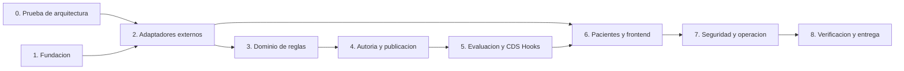

# Implementation Work Breakdown Structure

## RCE educativo con CQL, HAPI FHIR y CDS Hooks

| Campo             | Valor                         |
| ----------------- | ----------------------------- |
| Tipo de documento | Plan de implementacion / WBS  |
| Estado            | En ejecucion                  |
| Version           | 0.4.0                         |
| Fecha             | 2026-07-26                    |
| Base              | Requisitos y SDD del proyecto |

## 1. Proposito

Este documento divide el desarrollo en unidades de trabajo trazables y ordenadas por entregable. No redefine requisitos ni decisiones arquitectonicas.

- Requisitos: [REQUIREMENTS.md](./REQUIREMENTS.md)
- Diseno: [DESIGN.md](./DESIGN.md)

La estructura es una Work Breakdown Structure orientada a productos y sigue la recomendacion general de descomponer jerarquicamente el trabajo necesario para completar el proyecto.

## 2. Convenciones

### 2.1 Estados

| Estado        | Significado                                        |
| ------------- | -------------------------------------------------- |
| `TODO`        | Aun no iniciada.                                   |
| `IN_PROGRESS` | En desarrollo activo.                              |
| `BLOCKED`     | No puede avanzar por una dependencia o decision.   |
| `REVIEW`      | Implementada y pendiente de revision/verificacion. |
| `DONE`        | Cumple su Definition of Done.                      |

### 2.2 Tamano

| Tamano | Alcance esperado                                           |
| ------ | ---------------------------------------------------------- |
| `S`    | Cambio localizado, normalmente hasta un dia.               |
| `M`    | Varios componentes relacionados, normalmente 1 a 3 dias.   |
| `L`    | Entregable amplio que deberia revisarse antes de comenzar. |

Los tamanos son relativos y no constituyen compromiso de calendario.

### 2.3 Regla de una tarea

Cada tarea debe:

- Producir un entregable observable.
- Nombrarse con verbo y objeto.
- Identificar dependencias.
- Referenciar requisitos cuando implemente comportamiento.
- Incluir o actualizar pruebas relevantes.
- Poder cambiar a `DONE` sin depender de trabajo ambiguo posterior.

## 3. Definition of Done global

Una tarea solo puede marcarse `DONE` cuando:

- El codigo compila y pasa lint/format.
- Las pruebas nuevas y existentes pasan.
- Los contratos o fixtures afectados estan actualizados.
- No contiene secretos, datos reales ni tags Docker flotantes.
- Los errores usan el contrato y correlationId del sistema.
- El aislamiento por sandbox se conserva cuando la tarea toca sesiones, reglas,
  pacientes, CDS o auditoria.
- La documentacion de configuracion cambia junto con el comportamiento.
- La trazabilidad con requisitos sigue siendo valida.
- El entregable fue revisado manualmente cuando incluye UX o interoperabilidad externa.

## 4. Dependencias de alto nivel



## 5. WBS 0 - Prueba de arquitectura

Objetivo: demostrar la cadena tecnica antes de construir features.

| ID       | Tarea/entregable                                                               | Dependencias | Requisitos                      | Tamano | Estado |
| -------- | ------------------------------------------------------------------------------ | ------------ | ------------------------------- | ------ | ------ |
| TASK-0.1 | Seleccionar y registrar versiones candidatas de HAPI, traductor y tooling CQL. | Ninguna      | REQ-NF-002                      | S      | DONE   |
| TASK-0.2 | Crear Compose minimo con HAPI, PostgreSQL y CQL Translation Service.           | 0.1          | REQ-NF-024, REQ-NF-025          | M      | DONE   |
| TASK-0.3 | Comprobar `/metadata` de HAPI y recursos FHIR requeridos.                      | 0.2          | REQ-F-049, REQ-NF-003           | S      | DONE   |
| TASK-0.4 | Instalar FHIRHelpers R4 y un paciente sintetico minimo.                        | 0.2          | REQ-F-008, REQ-D-007, REQ-D-008 | M      | TODO   |
| TASK-0.5 | Traducir un fixture CQL a ELM mediante HTTP.                                   | 0.2, 0.4     | REQ-F-005, REQ-NF-003           | S      | REVIEW |
| TASK-0.6 | Construir y leer Library compatible con CQL, ELM y metadata.                   | 0.5          | REQ-D-001 a REQ-D-005           | M      | REVIEW |
| TASK-0.7 | Ejecutar ELM contra `Patient/$everything` y documentar respuesta real.         | 0.3, 0.6     | REQ-F-020, REQ-NF-003           | M      | REVIEW |
| TASK-0.8 | Verificar prueba de draft validado sin publicacion compartida.                 | 0.7          | REQ-F-019                       | S      | REVIEW |
| TASK-0.9 | Publicar matriz de compatibilidad y decision go/no-go.                         | 0.1 a 0.8    | REQ-NF-002, REQ-NF-003          | S      | TODO   |

Gate `M0`: no comienza WBS 3-6 hasta completar TASK-0.9.

Los servicios base fueron levantados en Fedora y el readiness comprobo HAPI y
el traductor. El gate M0 sigue abierto hasta registrar evidencia reproducible
de Synthea y de evaluacion CQL contra pacientes.

## 6. WBS 1 - Fundacion del repositorio

Objetivo: establecer una base reproducible para frontend, backend e infraestructura.

| ID        | Tarea/entregable                                                                   | Dependencias | Requisitos                       | Tamano | Estado |
| --------- | ---------------------------------------------------------------------------------- | ------------ | -------------------------------- | ------ | ------ |
| TASK-1.1  | Crear estructura de workspace para frontend, backend, contratos e infraestructura. | Ninguna      | REQ-NF-022, REQ-NF-024           | M      | REVIEW |
| TASK-1.2  | Crear NestJS con TypeScript strict, lint, format y tests.                          | 1.1          | REQ-NF-022, REQ-NF-026           | M      | DONE   |
| TASK-1.3  | Implementar ConfigModule tipado y validacion de variables.                         | 1.2          | REQ-F-050, REQ-NF-012            | M      | DONE   |
| TASK-1.4  | Implementar error model y exception filter global.                                 | 1.2          | REQ-I-006                        | M      | DONE   |
| TASK-1.5  | Implementar correlationId y logging JSON con redaccion.                            | 1.2, 1.3     | REQ-NF-010, REQ-NF-023           | M      | DONE   |
| TASK-1.6  | Implementar `/health/live` y esqueleto de readiness.                               | 1.3          | REQ-F-047, REQ-F-048             | S      | DONE   |
| TASK-1.7  | Generar OpenAPI y convenciones de DTOs.                                            | 1.2, 1.4     | REQ-I-005, REQ-I-006             | S      | DONE   |
| TASK-1.8  | Integrar backend y frontend vacios en Docker Compose.                              | 1.1 a 1.7    | REQ-NF-024, REQ-NF-025           | M      | REVIEW |
| TASK-1.9  | Integrar generador Synthea reproducible y carga idempotente en HAPI local.         | 0.2          | REQ-D-007, REQ-D-009             | M      | REVIEW |
| TASK-1.10 | Definir configuracion de modo aula anonimo y variables de sesion.                  | 1.3          | REQ-F-051, REQ-I-007, REQ-NF-028 | S      | REVIEW |

Evidencia de TASK-1.2 a TASK-1.7:
`docs/evidence/M1/runs/20260726T094853Z/summary.md`. TASK-1.1 y TASK-1.8 esperan
la SPA y el paquete de contratos. TASK-1.9 espera ejecutar y contar la poblacion
real en el HAPI local. Evidencia de TASK-1.10:
`docs/evidence/M1/runs/20260727T071109Z/summary.md`.

## 7. WBS 2 - Adaptadores externos

Objetivo: aislar HAPI y CQL Translation Service tras puertos probados.

| ID        | Tarea/entregable                                                          | Dependencias | Requisitos                       | Tamano | Estado |
| --------- | ------------------------------------------------------------------------- | ------------ | -------------------------------- | ------ | ------ |
| TASK-2.1  | Definir tipos comunes FHIR y contratos de puertos.                        | 1.2          | REQ-NF-022                       | M      | TODO   |
| TASK-2.2  | Implementar HapiFhirAdapter para read y search.                           | 2.1, 1.3     | REQ-I-002, REQ-F-050             | M      | TODO   |
| TASK-2.3  | Implementar `$validate`, transaction y normalizacion de OperationOutcome. | 2.2          | REQ-F-028, REQ-F-029, REQ-I-006  | M      | TODO   |
| TASK-2.4  | Implementar ETags, If-Match y errores de concurrencia.                    | 2.2, 2.3     | REQ-NF-013                       | M      | TODO   |
| TASK-2.5  | Implementar autenticacion configurable hacia HAPI.                        | 1.3, 2.2     | REQ-F-050, REQ-NF-012            | S      | TODO   |
| TASK-2.6  | Implementar CqlTranslationHttpAdapter para request simple.                | 2.1, 1.3     | REQ-F-005, REQ-I-003             | M      | REVIEW |
| TASK-2.7  | Implementar multipart e includes versionados.                             | 2.6, 2.2     | REQ-F-008, REQ-D-008             | M      | TODO   |
| TASK-2.8  | Normalizar diagnosticos a linea, columna, severidad y mensaje.            | 2.6          | REQ-F-006, REQ-NF-018            | M      | TODO   |
| TASK-2.9  | Completar readiness, capability check y modo degradado de dependencias.   | 2.2, 2.6     | REQ-F-048, REQ-F-049, REQ-NF-017 | M      | REVIEW |
| TASK-2.10 | Crear contract tests de HAPI y traductor con fixtures de WBS 0.           | 2.2 a 2.9    | REQ-NF-026                       | M      | TODO   |
| TASK-2.11 | Propagar SessionContext por puertos y adapters FHIR.                      | 1.10, 2.1    | REQ-F-052, REQ-F-053, REQ-D-010  | M      | TODO   |

Gate `M1`: Nest puede leer HAPI, traducir CQL y reportar salud sin logica de reglas.

TASK-2.6 y TASK-2.9 tienen pruebas unitarias y smoke HTTP local. Permanecen en
`REVIEW` hasta probarlos contra los contenedores reales. El gate M0 sigue
bloqueando WBS 3-6, no el trabajo de fundacion no clinica.

## 8. WBS 3 - Dominio y persistencia de reglas

Objetivo: representar borradores, versiones y lifecycle sobre FHIR.

| ID        | Tarea/entregable                                                     | Dependencias  | Requisitos                                  | Tamano | Estado |
| --------- | -------------------------------------------------------------------- | ------------- | ------------------------------------------- | ------ | ------ |
| TASK-3.1  | Implementar ClinicalRule, value objects e invariantes.               | 1.2           | REQ-F-004, REQ-F-009, REQ-F-012 a REQ-F-016 | M      | TODO   |
| TASK-3.2  | Implementar maquina de estados draft/validated/published/retired.    | 3.1           | REQ-F-012 a REQ-F-016, REQ-D-005            | M      | TODO   |
| TASK-3.3  | Definir canonical URL, semver y estrategia de logical ids.           | 3.1, 1.3      | REQ-D-003, REQ-D-004                        | S      | TODO   |
| TASK-3.4  | Implementar mapper ClinicalRule a Library draft.                     | 3.1, 2.1      | REQ-D-001, REQ-D-003                        | M      | TODO   |
| TASK-3.5  | Mapear metadata ejecutable de regla a extensiones Library.           | 3.1, 2.1      | REQ-D-002, REQ-D-003, REQ-D-005             | M      | REVIEW |
| TASK-3.6  | Crear StructureDefinitions de extensiones RCE.                       | 3.4, 3.5      | REQ-D-005, REQ-F-036                        | M      | TODO   |
| TASK-3.7  | Implementar repositorio FHIR de reglas y busquedas.                  | 3.4, 3.5, 2.2 | REQ-F-003, REQ-F-017                        | L      | REVIEW |
| TASK-3.8  | Implementar crear, obtener y editar borrador.                        | 3.2, 3.7, 2.4 | REQ-F-001 a REQ-F-004                       | M      | TODO   |
| TASK-3.9  | Eliminar ELM/validated al modificar fuente ejecutable.               | 3.2, 3.8      | REQ-F-011                                   | S      | TODO   |
| TASK-3.10 | Implementar enable, disable, retire y version unica activa.          | 3.2, 3.7      | REQ-F-014 a REQ-F-016                       | L      | TODO   |
| TASK-3.11 | Implementar Task FHIR para Idempotency-Key.                          | 2.3, 3.7      | REQ-NF-015, REQ-NF-016                      | M      | TODO   |
| TASK-3.12 | Namespacear reglas y artefactos FHIR por sandbox o scope compartido. | 2.11, 3.7     | REQ-F-052, REQ-F-053, REQ-D-010             | M      | TODO   |

## 9. WBS 4 - Autoria y publicacion

Objetivo: completar CQL -> ELM -> artefactos FHIR versionados.

| ID       | Tarea/entregable                                                   | Dependencias   | Requisitos                                   | Tamano | Estado |
| -------- | ------------------------------------------------------------------ | -------------- | -------------------------------------------- | ------ | ------ |
| TASK-4.1 | Implementar resolver de FHIRHelpers e includes por nombre/version. | 2.7, 3.7       | REQ-F-008, REQ-D-008                         | M      | TODO   |
| TASK-4.2 | Implementar caso de uso ValidateRule.                              | 3.8, 4.1, 2.8  | REQ-F-005, REQ-F-006                         | M      | TODO   |
| TASK-4.3 | Inspeccionar ELM y verificar conditionExpression Boolean.          | 4.2, 3.1       | REQ-F-009                                    | M      | TODO   |
| TASK-4.4 | Persistir ELM vigente y transition a validated.                    | 4.2, 4.3, 3.2  | REQ-F-007, REQ-F-011                         | M      | TODO   |
| TASK-4.5 | Exponer endpoints validate y elm con OpenAPI.                      | 4.2 a 4.4      | REQ-F-005 a REQ-F-007                        | S      | TODO   |
| TASK-4.6 | Implementar mapper de artefactos published.                        | 3.4 a 3.6, 4.4 | REQ-F-010, REQ-D-001 a REQ-D-005             | M      | TODO   |
| TASK-4.7 | Implementar publicacion atomica con Provenance y Task.             | 3.11, 4.6      | REQ-F-010 a REQ-F-015, REQ-F-043, REQ-NF-014 | L      | TODO   |
| TASK-4.8 | Implementar proteccion de version publicada inmutable.             | 3.7, 4.7       | REQ-F-012, REQ-F-013                         | M      | TODO   |
| TASK-4.9 | Crear integration tests de validacion y publicacion.               | 4.1 a 4.8      | AC-001, AC-002, AC-003                       | L      | TODO   |

Gate `M2`: regla creada en API, validada, publicada y visible como Library en HAPI.

## 10. WBS 5 - Evaluacion y CDS Hooks

Objetivo: ejecutar reglas y exponer soporte de decisiones estandar.

| ID        | Tarea/entregable                                                       | Dependencias  | Requisitos                                            | Tamano | Estado |
| --------- | ---------------------------------------------------------------------- | ------------- | ----------------------------------------------------- | ------ | ------ |
| TASK-5.1  | Implementar RuleExecutionModule con `cql-execution` y `cql-exec-fhir`. | 2.2, 0.7      | REQ-F-020                                             | L      | REVIEW |
| TASK-5.2  | Normalizar resultado booleano/errores a RuleEvaluationResult.          | 5.1           | REQ-F-021, REQ-F-022                                  | M      | REVIEW |
| TASK-5.3  | Implementar prueba de borrador validated con bundle FHIR de paciente.  | 5.1, 4.4, 0.8 | REQ-F-018, REQ-F-019                                  | M      | REVIEW |
| TASK-5.4  | Implementar seleccion y evaluacion de reglas activas por hook.         | 3.10, 5.2     | REQ-F-023, REQ-F-024                                  | L      | TODO   |
| TASK-5.5  | Implementar mapper RuleEvaluationResult a CDS Card.                    | 5.2, 3.5      | REQ-F-021, REQ-F-034 a REQ-F-037                      | M      | TODO   |
| TASK-5.6  | Implementar CDS Services Discovery.                                    | 5.4           | REQ-F-032, REQ-I-004                                  | M      | TODO   |
| TASK-5.7  | Implementar `rce-patient-view`.                                        | 5.4 a 5.6     | REQ-F-033, REQ-F-034, REQ-F-035, REQ-F-036, REQ-F-037 | L      | TODO   |
| TASK-5.8  | Implementar `rce-order-select` y `rce-order-sign`.                     | 5.7           | REQ-F-033 a REQ-F-037                                 | L      | TODO   |
| TASK-5.9  | Implementar prefetch y allowlist de fhirServer.                        | 5.7, 2.5      | REQ-NF-011, REQ-I-004                                 | M      | TODO   |
| TASK-5.10 | Implementar aislamiento, concurrencia limitada y orden de cards.       | 5.4, 5.5      | REQ-F-024, REQ-F-037, REQ-NF-006                      | M      | TODO   |
| TASK-5.11 | Implementar feedback CDS y AuditEvent.                                 | 5.6, 3.11     | REQ-F-041, REQ-F-044                                  | M      | TODO   |
| TASK-5.12 | Crear contract/e2e tests CDS Hooks.                                    | 5.6 a 5.11    | AC-004, AC-006, AC-007                                | L      | TODO   |
| TASK-5.13 | Filtrar evaluacion CDS por sandbox y reglas compartidas.               | 5.4, 3.12     | REQ-F-052, REQ-F-053, REQ-NF-027                      | M      | TODO   |

Gate `M3`: `patient-view` produce cards dinamicas desde CQL ejecutado en HAPI.

## 11. WBS 6 - Pacientes y experiencia educativa

Objetivo: permitir modificar pacientes y observar cambios en las reglas dentro del RCE.

| ID        | Tarea/entregable                                                | Dependencias         | Requisitos                                   | Tamano | Estado |
| --------- | --------------------------------------------------------------- | -------------------- | -------------------------------------------- | ------ | ------ |
| TASK-6.1  | Implementar busqueda y listado de pacientes.                    | 2.2                  | REQ-F-025                                    | M      | TODO   |
| TASK-6.2  | Implementar ficha agregada y queries relacionadas.              | 6.1                  | REQ-F-026                                    | L      | TODO   |
| TASK-6.3  | Implementar allowlist y actualizacion con `$validate`/ETag.     | 2.3, 2.4, 6.2        | REQ-F-027, REQ-F-028                         | L      | TODO   |
| TASK-6.4  | Implementar transaction clinica multi-recurso.                  | 6.3                  | REQ-F-029                                    | M      | TODO   |
| TASK-6.5  | Implementar ClinicalDataChanged y reevaluacion sincrona.        | 6.3, 5.4             | REQ-F-030, REQ-F-031, REQ-F-042              | L      | TODO   |
| TASK-6.6  | Implementar validacion y aplicacion idempotente de sugerencias. | 6.3, 6.4, 3.11, 5.5  | REQ-F-038, REQ-F-039, REQ-F-040, AC-008      | L      | TODO   |
| TASK-6.7  | Crear SPA React/Vite y cliente tipado de API.                   | 1.1, 1.7             | REQ-I-001, REQ-I-005                         | M      | TODO   |
| TASK-6.8  | Implementar catalogo de reglas y estados visuales.              | 6.7, 3.8             | REQ-F-017, REQ-NF-020                        | M      | TODO   |
| TASK-6.9  | Integrar Monaco, metadata, guardado y markers.                  | 6.7, 4.5             | REQ-F-002, REQ-F-004 a REQ-F-007, REQ-NF-018 | L      | TODO   |
| TASK-6.10 | Implementar ElmViewer y RuleTestPanel.                          | 6.9, 5.3             | REQ-F-007, REQ-F-018 a REQ-F-021             | M      | TODO   |
| TASK-6.11 | Implementar PatientChart y formularios clinicos.                | 6.2 a 6.5, 6.7, 6.14 | REQ-F-025 a REQ-F-031, REQ-D-011             | L      | REVIEW |
| TASK-6.12 | Implementar CdsCardList y confirmacion de sugerencias.          | 5.5, 6.6, 6.7        | REQ-F-034 a REQ-F-040                        | L      | TODO   |
| TASK-6.13 | Crear pacientes y reglas sinteticas de demostracion.            | 6.11, 4.7            | REQ-D-007, AC-004, AC-005                    | L      | TODO   |
| TASK-6.14 | Implementar copy-on-write de pacientes base por sandbox.        | 6.2, 2.11            | REQ-D-011, REQ-F-052, REQ-F-053              | L      | REVIEW |
| TASK-6.15 | Mostrar sesion anonima y reinicio de sandbox en la UI.          | 6.7, 7.1             | REQ-F-051, REQ-F-054, REQ-I-007              | M      | TODO   |

Gate `M4`: editar un paciente desde la UI hace aparecer o desaparecer una card sin salir del RCE.

Evidencia parcial de TASK-6.11 y TASK-6.14:
`docs/evidence/M1/runs/20260727T082410Z/summary.md`. Permanecen en `REVIEW`
hasta ejecutar AC-005/AC-011 contra Docker real.

## 12. WBS 7 - Seguridad, auditoria y operacion

Objetivo: completar controles transversales, sesiones anonimas y visibilidad operativa.

| ID       | Tarea/entregable                                                              | Dependencias   | Requisitos                                         | Tamano | Estado |
| -------- | ----------------------------------------------------------------------------- | -------------- | -------------------------------------------------- | ------ | ------ |
| TASK-7.1 | Implementar ClassroomSessionModule, cookie firmada y modo de identidad local. | 1.10           | REQ-F-051, REQ-I-007, REQ-NF-028                   | M      | REVIEW |
| TASK-7.2 | Implementar guards student/teacher y sandbox scope en endpoints.              | 7.1, 4.5, 6.3  | REQ-F-045, REQ-F-046, REQ-F-052, REQ-F-053, AC-009 | M      | TODO   |
| TASK-7.3 | Configurar Helmet, CORS, body limit y rate limit.                             | 1.3, 1.4       | REQ-NF-009                                         | M      | TODO   |
| TASK-7.4 | Implementar allowlists de hosts, recursos y dependencies.                     | 2.5, 4.1, 6.3  | REQ-NF-011                                         | M      | TODO   |
| TASK-7.5 | Auditar publicacion, evaluacion, feedback y sugerencias.                      | 4.7, 5.11, 6.6 | REQ-F-043, REQ-F-044                               | L      | TODO   |
| TASK-7.6 | Implementar metricas de traduccion, evaluacion y cards.                       | 1.5, 5.4       | REQ-NF-023                                         | M      | TODO   |
| TASK-7.7 | Completar redaccion de logs y revision de secretos.                           | 1.5, 7.3       | REQ-NF-010, REQ-NF-012                             | M      | TODO   |
| TASK-7.8 | Verificar teclado, foco y cards sin dependencia exclusiva del color.          | 6.8 a 6.12     | REQ-NF-019 a REQ-NF-021                            | M      | TODO   |
| TASK-7.9 | Implementar expiracion, reinicio y retencion de sandboxes.                    | 7.1, 2.11      | REQ-F-054, REQ-NF-029                              | M      | TODO   |

Evidencia parcial de TASK-7.1:
`docs/evidence/M1/runs/20260727T071109Z/summary.md`. Permanece en `REVIEW`
hasta validar AC-011 con navegadores/sesiones concurrentes.

## 13. WBS 8 - Verificacion y entrega

Objetivo: demostrar cumplimiento, reproducibilidad y preparacion para clase.

| ID        | Tarea/entregable                                                         | Dependencias          | Requisitos                                                 | Tamano | Estado |
| --------- | ------------------------------------------------------------------------ | --------------------- | ---------------------------------------------------------- | ------ | ------ |
| TASK-8.1  | Completar unit tests de dominio, mappers, cards, errors y guards.        | WBS 3-7               | REQ-NF-026                                                 | L      | TODO   |
| TASK-8.2  | Completar contract tests de CQL, FHIR y CDS Hooks.                       | 2.10, 4.9, 5.12       | REQ-NF-026                                                 | L      | TODO   |
| TASK-8.3  | Crear suite integration con servicios Docker reales.                     | WBS 2-7               | REQ-NF-003, REQ-NF-026                                     | L      | TODO   |
| TASK-8.4  | Automatizar AC-001 a AC-011 end-to-end.                                  | 8.1 a 8.3             | AC-001 a AC-011                                            | L      | TODO   |
| TASK-8.5  | Ejecutar pruebas p95 y documentar resultados/limites.                    | 8.3, 6.13             | REQ-NF-004, REQ-NF-005, REQ-NF-006, REQ-NF-007, REQ-NF-027 | M      | TODO   |
| TASK-8.6  | Ejecutar revision de seguridad y privacidad sintetica.                   | WBS 7, 8.3            | REQ-NF-008 a REQ-NF-012, REQ-NF-028, REQ-NF-029            | M      | TODO   |
| TASK-8.7  | Fijar imagenes, variables de ejemplo y runbook Compose.                  | 8.3, 8.6              | REQ-NF-024, REQ-NF-025, REQ-NF-028                         | M      | TODO   |
| TASK-8.8  | Documentar escenarios docentes y pasos de demostracion.                  | 6.13, 8.4, 8.10       | AC-004, AC-005, AC-011                                     | M      | TODO   |
| TASK-8.9  | Ejecutar ensayo de entrega desde un entorno limpio.                      | 8.4 a 8.8             | AC-010                                                     | M      | TODO   |
| TASK-8.10 | Ejecutar prueba multiusuario con dos navegadores y 10 sesiones anonimas. | 7.1, 3.12, 5.13, 6.14 | AC-011, REQ-NF-027                                         | M      | TODO   |

Gate `M5`: todos los criterios AC-001 a AC-011 pasan y la demo se levanta desde cero.

## 14. Hitos

| Hito                      | Evidencia                                                     | Tareas requeridas   |
| ------------------------- | ------------------------------------------------------------- | ------------------- |
| M0 - Arquitectura probada | CQL -> ELM -> Library -> Patient/$everything -> cql-execution | TASK-0.1 a TASK-0.9 |
| M1 - Integraciones listas | Nest consulta HAPI y traduce CQL                              | WBS 1 y 2           |
| M2 - Autoria lista        | CRUD, validacion, ELM y publicacion                           | WBS 3 y 4           |
| M3 - CDS listo            | `patient-view` produce cards                                  | WBS 5               |
| M4 - Experiencia docente  | Cambio clinico modifica cards en UI                           | WBS 6               |
| M5 - Entrega reproducible | Criterios, seguridad, rendimiento y runbook                   | WBS 7 y 8           |

## 15. Ruta critica inicial

```text
0.1 -> 0.2 -> 0.5 -> 0.6 -> 0.7 -> 0.9
    -> 1.2 -> 2.2/2.6 -> 3.7 -> 4.2 -> 4.7
    -> 5.1 -> 5.4 -> 5.7 -> 6.5 -> 6.11/6.12 -> 7.1
    -> 3.12/6.14 -> 8.4/8.10
```

La incompatibilidad detectada en WBS 0 debe resolverse antes de estimar el resto del proyecto.

## 16. Spikes y decisiones asociadas

| Spike     | Pregunta                                           | Resultado esperado                                 |
| --------- | -------------------------------------------------- | -------------------------------------------------- |
| TASK-0.7  | El ELM del traductor fijado se ejecuta en Nest     | Matriz compatible o cambio de version.             |
| TASK-0.8  | Un draft validado se prueba sin publicarlo         | Camino directo documentado.                        |
| TASK-5.2  | Que forma exacta devuelve `cql-execution`          | Normalizador respaldado por fixtures.              |
| TASK-5.10 | Cuanta concurrencia tolera el entorno local        | Limite inicial medido.                             |
| TASK-8.10 | El aislamiento por sandbox resiste uso concurrente | Dos navegadores y 10 sesiones sin mezcla de datos. |
| TASK-8.5  | Se cumplen objetivos p95                           | Resultados y ajustes de alcance.                   |

## 17. Seguimiento

Al comenzar trabajo:

1. Cambiar una sola tarea a `IN_PROGRESS` por responsable.
2. Registrar bloqueos en la propia fila o issue vinculado.
3. No marcar `DONE` sin pruebas/evidencia indicada.
4. Actualizar requisitos o SDD antes de implementar un cambio de alcance o arquitectura.
5. Revisar los gates M0-M5 antes de iniciar la siguiente etapa dependiente.

## 18. Referencias

- [NASA Software Engineering Handbook - Work Breakdown Structures](https://swehb.nasa.gov/spaces/SWEHBVD/pages/102695623/7.05%2B-%2BWork%2BBreakdown%2BStructures%2BThat%2BInclude%2BSoftware)
- [REQUIREMENTS.md](./REQUIREMENTS.md)
- [DESIGN.md](./DESIGN.md)
