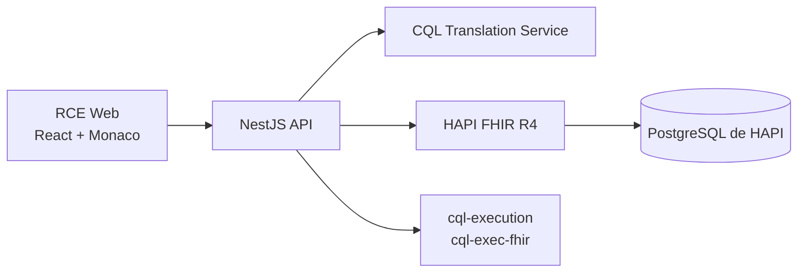
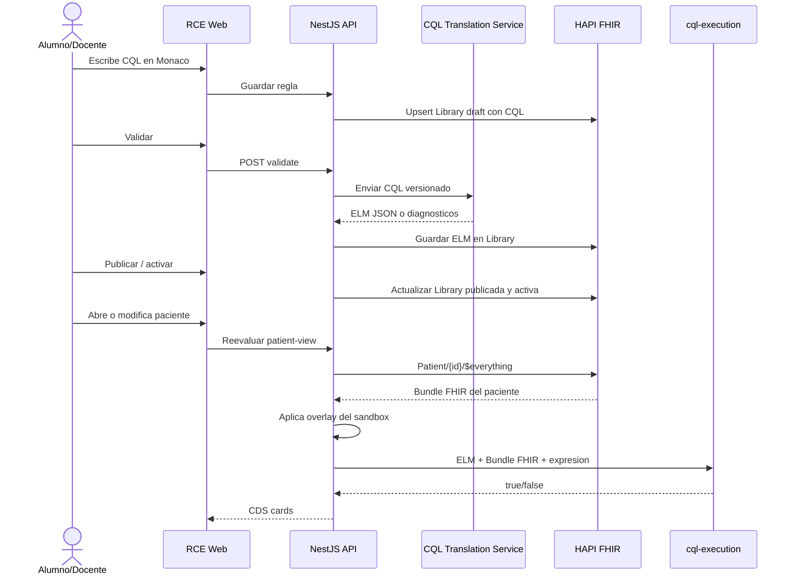
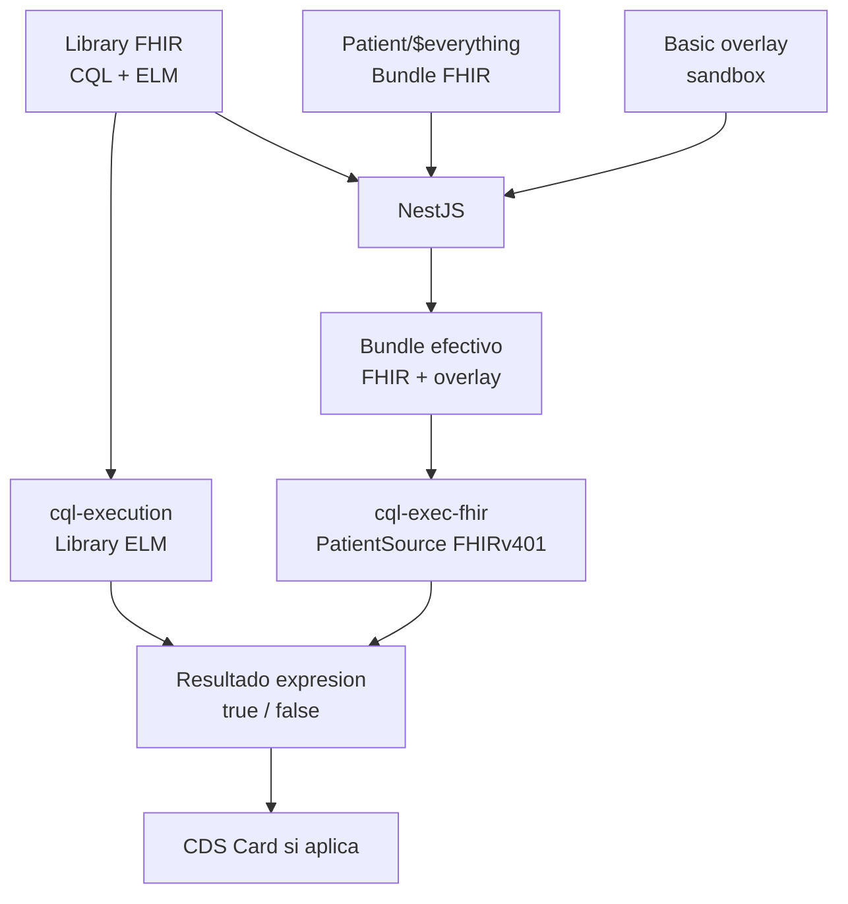

# Documentacion tecnica del RCE CQL

## 1. Objetivo del documento

Este documento explica la arquitectura implementada hasta ahora y, sobre todo,
el camino completo que sigue una regla CQL desde que se escribe en el RCE hasta
que produce una card CDS Hooks.

La explicacion esta pensada para revision tecnica del docente o administrador:
describe que hace cada servicio, que se guarda en HAPI FHIR y que parte ejecuta
NestJS.

## 2. Resumen ejecutivo

El RCE educativo permite escribir reglas CQL dentro del frontend. El backend
NestJS no interpreta CQL por cuenta propia. En vez de eso, envia el texto CQL a
un servicio especializado llamado CQL Translation Service. Ese servicio valida
la sintaxis y transforma el CQL a ELM JSON.

ELM es la representacion estructurada y ejecutable de una regla CQL. Para el
RCE, CQL es el lenguaje que escribe el alumno y ELM es el modelo que puede usar
el motor de ejecucion.

Una regla validada se guarda en HAPI como recurso FHIR `Library`. La `Library`
contiene:

- El CQL original.
- El ELM generado.
- Metadata educativa: hook, expresion booleana, resumen de la card, detalle,
  severidad, estado, version y activacion.

Cuando se abre o modifica un paciente, NestJS obtiene desde HAPI el bundle FHIR
del paciente mediante `Patient/{id}/$everything`, aplica los cambios privados
del sandbox y ejecuta el ELM con librerias existentes (`cql-execution` y
`cql-exec-fhir`). Si la expresion configurada devuelve `true`, NestJS genera
una card CDS.

En el estado actual, HAPI funciona como repositorio FHIR de pacientes, reglas,
overlays y actividad. La evaluacion educativa la ejecuta NestJS con un motor CQL
existente. No se implementa un parser, traductor ni motor CQL propio.

## 3. Servicios y responsabilidades



| Servicio | Responsabilidad |
| --- | --- |
| Frontend React | Muestra pacientes, editor CQL, reglas, ELM, pruebas y cards. |
| NestJS API | Orquesta reglas, pacientes, sandboxes, HAPI, traductor y CDS Hooks. |
| CQL Translation Service | Valida CQL y lo transforma a ELM JSON. |
| HAPI FHIR | Guarda pacientes FHIR, `Library`, overlays `Basic` y actividad. |
| PostgreSQL | Base interna de HAPI. El RCE nunca la consulta directo. |
| `cql-execution` + `cql-exec-fhir` | Ejecuta ELM contra bundles FHIR R4. |

Regla importante: el navegador no habla directo con HAPI ni con el traductor. El
frontend consume solo la API NestJS.

## 4. Que son CQL, ELM y Library en este sistema

### 4.1 CQL

CQL, Clinical Quality Language, es el lenguaje que escribe el alumno o docente.
Esta pensado para expresar logica clinica usando datos FHIR.

Ejemplo simple:

```cql
library AgeRuleDemo version '0.1.0'

using FHIR version '4.0.1'

context Patient

define "Aplica":
  AgeInYears() >= 18
```

En este ejemplo:

- `library` define el nombre y version de la regla.
- `using FHIR version '4.0.1'` indica que la regla trabaja sobre FHIR R4.
- `context Patient` indica que la evaluacion ocurre en contexto de un paciente.
- `"Aplica"` es la expresion booleana que el RCE evaluara.

### 4.2 ELM

ELM, Expression Logical Model, es el resultado de traducir CQL. Ya no es texto
para humanos, sino JSON estructurado.

El ELM conserva la logica del CQL en una forma que puede ejecutar un engine.
Por eso el flujo correcto no es ejecutar el texto CQL directamente:

```text
CQL escrito por alumno -> CQL Translation Service -> ELM JSON -> motor CQL
```

### 4.3 FHIR Library

FHIR `Library` es el recurso usado para persistir conocimiento clinico. En el
RCE cada regla se guarda como `Library`.

La `Library` contiene el CQL y, cuando existe, el ELM:

```text
Library.content[contentType="text/cql"]
Library.content[contentType="application/elm+json"]
```

Ambos contenidos se guardan en Base64 segun el formato FHIR. Ademas, el backend
agrega metadata con extensiones propias del RCE para saber como ejecutar la
regla y como convertir su resultado en card.

## 5. Flujo completo CQL a ELM a card



## 6. Flujo de autoria de reglas

### 6.1 Crear regla

1. El usuario crea una nueva regla en el frontend.
2. El frontend manda CQL y metadata a NestJS.
3. NestJS asigna version inicial automaticamente.
4. NestJS normaliza el encabezado `library`.
5. NestJS guarda la regla como `Library` en HAPI con estado de borrador.

La metadata minima de una regla incluye:

- Titulo visible.
- Nombre CQL.
- Hook asociado: `patient-view`, `order-select` u `order-sign`.
- Expresion booleana a evaluar, por ejemplo `"Aplica"`.
- Summary, detail e indicator de la card CDS.
- Estado editorial: draft, validated, published, disabled o retired.
- Activacion: activa o inactiva.
- Alcance: sandbox o shared.

### 6.2 Validar regla

Cuando el usuario presiona validar:

1. NestJS lee la regla actual.
2. NestJS asegura que el CQL tenga nombre y version correctos.
3. NestJS envia el CQL al CQL Translation Service.
4. El traductor devuelve ELM si el CQL es valido.
5. NestJS guarda el ELM dentro de la misma `Library`.
6. La regla pasa a estado `validated`.
7. El frontend muestra un mensaje de ELM validado y permite publicar.

Si el CQL tiene errores, el traductor devuelve diagnosticos. El RCE los muestra
al usuario para corregir el texto.

### 6.3 Publicar regla

Publicar significa que la regla deja de ser solo borrador y empieza a participar
en evaluaciones.

En el backend:

1. Se exige que la regla este validada.
2. Se calcula version publicada automaticamente.
3. Se traduce nuevamente el CQL versionado para asegurar coherencia.
4. Se guarda CQL y ELM actualizados en la `Library`.
5. La regla queda `published` y `activation=true`.
6. Si la publica un alumno, queda limitada a su sandbox.
7. Si la publica un docente, puede quedar compartida.

## 7. Como interactua NestJS con HAPI FHIR

HAPI es la base FHIR del sistema. NestJS interactua con HAPI por API REST FHIR
R4, no por SQL.

### 7.1 Lectura de pacientes

Para listar pacientes:

```text
GET /Patient
GET /Condition
GET /Encounter
```

El listado usa cache corto para evitar que una clase con varios alumnos haga
demasiadas consultas repetidas.

Para abrir una ficha:

```text
GET /Patient/{id}/$everything
```

Ese bundle puede contener:

- `Patient`
- `Observation`
- `Condition`
- `MedicationRequest`
- `AllergyIntolerance`
- `Encounter`
- `Procedure`
- `Immunization`
- `ServiceRequest`

Estos son recursos FHIR R4 estandar. Si un HAPI externo no trae todos esos
recursos para un paciente, el RCE no debe fallar; simplemente mostrara menos
datos o "Sin dato".

### 7.2 Escritura de reglas

Las reglas se escriben como `Library`:

```text
PUT /Library/{ruleId}
GET /Library/{ruleId}
GET /Library?_tag=...cql-rule...
```

El tag de regla permite distinguir artefactos propios del RCE de otras
`Library` que pudieran existir en HAPI.

### 7.3 Escritura de overlays de sandbox

Cuando un alumno cambia datos de un paciente, el RCE no modifica directamente
el paciente base. Guarda un overlay privado del sandbox como recurso FHIR
`Basic`.

```text
PUT /Basic/{overlayId}
GET /Basic/{overlayId}
```

Ese overlay contiene, por ejemplo:

- Fecha de nacimiento editada.
- Sexo administrativo editado.
- Observaciones pedagogicas: presion, HbA1c, glucosa, LDL, IMC, peso, talla.
- Condicion diabetes.
- Medicamento metformina.
- Recursos clinicos guiados agregados por el alumno.

Al evaluar, NestJS toma el bundle real de HAPI y materializa encima los cambios
del overlay. Asi cada alumno puede cambiar el "mismo" paciente sin afectar a
otro alumno.

### 7.4 Escritura de actividad CDS

Cada evaluacion persistida puede guardarse como `Basic` con metadata de
actividad:

```text
PUT /Basic/{activityId}
GET /Basic?_tag=...cds-evaluation...
```

Esto alimenta la pantalla de Actividad CDS y el paso a paso pedagogico.

## 8. Evaluacion de reglas

La evaluacion usa datos FHIR y ELM.



Pasos tecnicos:

1. NestJS obtiene las reglas publicadas y activas para el hook.
2. NestJS obtiene `Patient/{id}/$everything`.
3. NestJS lee el overlay privado del sandbox.
4. NestJS genera un bundle efectivo FHIR R4.
5. NestJS lee el ELM desde la `Library`.
6. NestJS instancia `new cql.Library(JSON.parse(elmText))`.
7. NestJS crea `cqlfhir.PatientSource.FHIRv401()`.
8. NestJS carga el bundle en el PatientSource.
9. NestJS ejecuta la expresion configurada.
10. Si el resultado es `true`, se crea una card.
11. Si el resultado es `false`, no se muestra recomendacion.
12. Si una regla falla, se registra warning y no bloquea necesariamente las
    otras reglas.

La expresion evaluada no esta hardcodeada en TypeScript. Viene desde la metadata
de la regla, por ejemplo `"Aplica"`.

## 9. CDS Hooks

El RCE expone una fachada CDS Hooks en NestJS.

Endpoints principales:

```text
GET  /api/v1/cds-services
POST /api/v1/cds-services/rce-patient-view
POST /api/v1/cds-services/rce-order-select
POST /api/v1/cds-services/rce-order-sign
```

Un cliente CDS Hooks envia algo como:

```json
{
  "hook": "patient-view",
  "hookInstance": "uuid-de-la-evaluacion",
  "context": {
    "patientId": "123"
  },
  "prefetch": {
    "patient": {
      "resourceType": "Patient",
      "id": "123"
    }
  }
}
```

NestJS valida el hook y delega al mismo flujo de evaluacion usado por la UI. La
respuesta se adapta al formato CDS Hooks:

```json
{
  "cards": [
    {
      "uuid": "card-rce-rule",
      "summary": "Paciente cumple criterio",
      "detail": "La regla CQL evaluada indica que el paciente cumple el criterio.",
      "indicator": "info",
      "source": {
        "label": "AgeRuleDemo 1.0.0"
      }
    }
  ]
}
```

Si ninguna regla aplica, la respuesta correcta es:

```json
{
  "cards": []
}
```

## 10. Modo aula y sandbox

El modo aula anonimo permite que todos entren por la misma URL sin login visible.

El aislamiento se logra asi:

1. El navegador entra al RCE.
2. NestJS crea o recupera una cookie firmada HttpOnly.
3. Esa cookie identifica un `sandboxId` tecnico.
4. Toda regla privada, overlay y actividad se etiqueta con ese sandbox.
5. El frontend no decide el sandbox; el backend lo resuelve desde la cookie.
6. Dos alumnos pueden abrir el mismo paciente base, pero sus cambios quedan
   separados.

Ejemplo:

```text
Alumno A -> Patient/123 + overlay sandbox A -> reglas A -> cards A
Alumno B -> Patient/123 + overlay sandbox B -> reglas B -> cards B
```

HAPI contiene recursos FHIR compartidos y recursos privados etiquetados. NestJS
es quien filtra por sandbox.

## 11. Manejo de datos FHIR incompletos

FHIR permite que varios campos no existan. Por ejemplo, un paciente puede venir
sin `birthDate`, sin `gender`, sin `identifier` o sin algunos recursos clinicos
relacionados.

El RCE debe mantenerse dentro del estandar y no inventar datos clinicos. La
regla usada es:

- Si HAPI no trae un dato, se muestra como "Sin dato", "Sin fecha" o "Sin edad".
- Si una regla necesita ese dato, el resultado dependera de CQL y del engine.
- Si el alumno edita un dato, ese dato queda como overlay de su sandbox.
- El paciente base de HAPI no se modifica directamente en este flujo educativo.

Esto es importante para conectar con un HAPI externo del docente: no se asume
que todos los pacientes tengan todos los campos poblados.

## 12. Que esta implementado hasta ahora

### 12.1 Backend

Implementado:

- Configuracion tipada por variables de entorno.
- Health checks para HAPI y traductor.
- Adaptador HTTP para HAPI FHIR.
- Adaptador HTTP para CQL Translation Service.
- Traduccion CQL a ELM.
- CRUD educativo de reglas sobre `Library`.
- Versionado automatico inicial/publicado.
- Evaluacion ELM con `cql-execution` y `cql-exec-fhir`.
- Endpoint CDS Hooks discovery y servicios principales.
- Modo aula anonimo con cookie firmada y sandbox por navegador.
- Overlays de pacientes y recursos clinicos guiados.
- Tolerancia a pacientes FHIR con campos opcionales ausentes.

Archivos principales:

- `apps/api/src/modules/ui/application/ui.service.ts`
- `apps/api/src/modules/cql/infrastructure/cql-translation-http.adapter.ts`
- `apps/api/src/modules/fhir/infrastructure/hapi-fhir-http.adapter.ts`
- `apps/api/src/modules/cds-hooks/application/cds-hooks.service.ts`
- `apps/api/src/modules/classroom-session/application/classroom-session.service.ts`

### 12.2 Frontend

Implementado:

- Listado de pacientes.
- Ficha clinica con recursos FHIR agregados.
- Editor CQL con Monaco.
- Metadata de reglas.
- Validacion, vista ELM, prueba y publicacion.
- Cards CDS visibles en ficha.
- Actividad CDS con paso a paso pedagogico.
- Editor guiado de datos del paciente y recursos clinicos del sandbox.
- Manejo visual de datos ausentes.

Archivos principales:

- `apps/web/src/features/rules/RuleWorkspacePage.tsx`
- `apps/web/src/features/patients/PatientChartPage.tsx`
- `apps/web/src/features/patients/PatientsPage.tsx`
- `apps/web/src/features/activity/ActivityPage.tsx`
- `apps/web/src/lib/rce-api.ts`

### 12.3 Infraestructura

Implementado:

- `compose.yaml` principal.
- API y web como servicios propios.
- HAPI local opcional por perfil.
- PostgreSQL local para HAPI local.
- CQL Translation Service local opcional.
- Synthea seed para pacientes sinteticos locales.
- Modo servidor con HAPI externo configurable por `.env`.

## 13. Limites actuales y decisiones futuras

Lo actual:

- HAPI almacena pacientes, reglas y overlays.
- NestJS evalua ELM con engine existente.
- CDS Hooks se expone desde NestJS.
- El objetivo es docente y trabaja con datos sinteticos o anonimizados.

No implementado como motor propio:

- Parser CQL propio.
- Traductor CQL propio.
- Evaluador clinico ad hoc en TypeScript.
- Acceso directo a PostgreSQL de HAPI.

Pendiente o evolucion futura:

- Resolver includes CQL complejos y terminologia avanzada.
- Publicacion atomica mas estricta con `Task`, `Provenance` y transacciones
  FHIR completas.
- Uso opcional de HAPI Clinical Reasoning como adapter si el servidor externo lo
  soporta de forma compatible.
- Pruebas E2E completas con multiples navegadores y 10 sesiones anonimas.
- Hardening para pacientes reales: autenticacion institucional, autorizacion,
  auditoria formal y politicas de privacidad.

## 14. Explicacion corta para presentar

Para explicarlo en una reunion:

1. El alumno escribe una regla CQL dentro del RCE.
2. NestJS manda ese CQL a un traductor externo oficial.
3. El traductor devuelve ELM, que es la forma ejecutable de la regla.
4. NestJS guarda CQL y ELM en HAPI como recurso FHIR `Library`.
5. Cuando se abre o cambia un paciente, NestJS lee el paciente desde HAPI usando
   FHIR R4.
6. NestJS aplica los cambios privados del sandbox.
7. NestJS ejecuta el ELM contra los datos FHIR del paciente.
8. Si la expresion CQL da verdadero, NestJS produce una card CDS Hooks.
9. La card aparece en la ficha del RCE y queda trazabilidad pedagogica.

La clave arquitectonica es que cada pieza hace lo suyo: CQL se escribe en el
RCE, ELM lo genera el traductor, HAPI guarda recursos FHIR y NestJS orquesta el
flujo educativo con aislamiento por sandbox.

